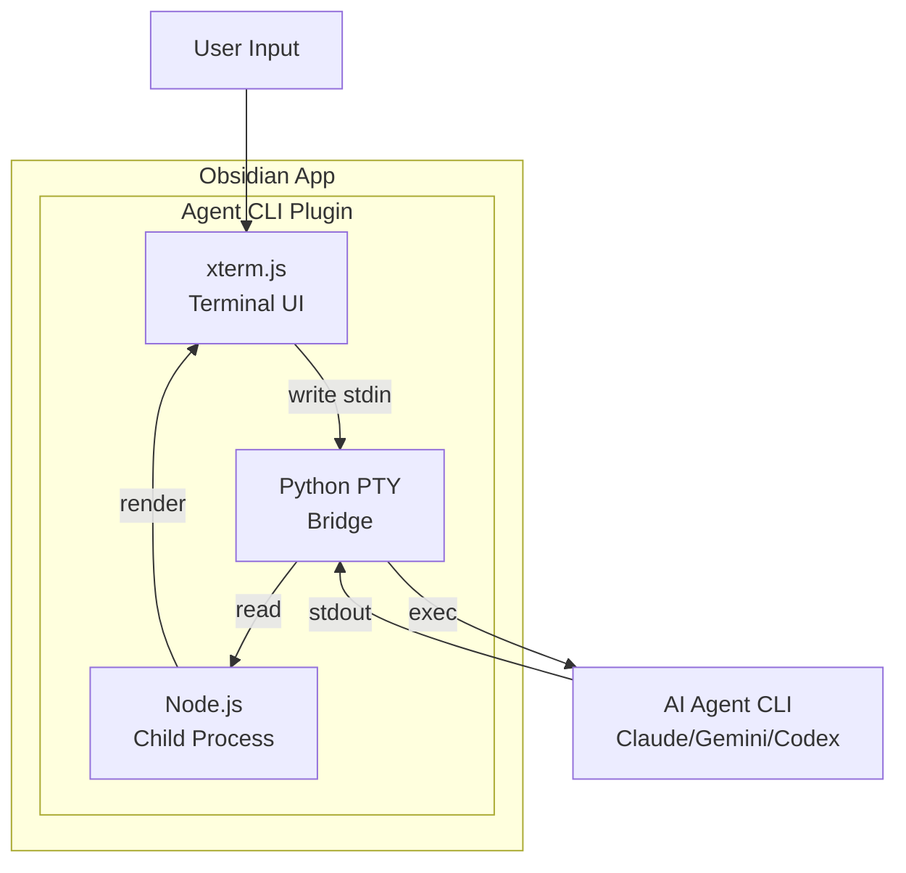

# Agent CLI

[](https://obsidian.md)
[](LICENSE)
[](manifest.json)

An Obsidian plugin that integrates AI agent terminals (Claude, Gemini, Codex) directly into your Obsidian sidebar.

## Features

- **Embedded Terminal** - Run AI agent CLI directly in Obsidian's sidebar
- **Multi-Agent Support** - Support for Claude CLI, Gemini CLI, and Codex CLI
- **Theme Auto-Detection** - Automatically matches Obsidian's dark/light theme
- **Current File Context** - Automatically send current file path to agent
- **Customizable Terminal** - Adjust font size and family to your preference

## Implementation Principle

This plugin works by leveraging the following technologies:

1. **xterm.js** - A terminal emulator component that renders the terminal UI in the browser
2. **Python PTY (Pseudo-Terminal)** - Uses Python's `pty` module to create a pseudo-terminal that spawns a shell process
3. **Node.js Child Process** - Communicates with the AI agent CLI through stdin/stdout streams

### Core Architecture



### How It Works

1. **Terminal Rendering**: The plugin uses xterm.js to render a terminal emulator within an Obsidian sidebar view
2. **PTY Creation**: When the agent starts, Python creates a pseudo-terminal using `pty.fork()` to emulate a real TTY
3. **Shell Spawning**: The plugin spawns a zsh shell within the PTY, which then executes the configured AI agent command
4. **I/O Stream Handling**:
   - Terminal input from xterm.js is written to the PTY's stdin
   - Agent output from the PTY's stdout is rendered in xterm.js
5. **Theme Sync**: The plugin detects Obsidian's theme (dark/light) and applies corresponding colors to xterm.js

## Installation

### Option 1: Direct Installation (Recommended for Development)

1. Build the plugin:

   ```bash
   cd agent-cli
   npm run build
   ```

2. Copy the plugin folder to your Obsidian plugins directory:

   ```bash
   cp -r /path/to/agent-cli ~/.obsidian/plugins/agent-cli
   ```

3. Open Obsidian, go to **Settings → Community Plugins**, and enable "Agent CLI"

### Option 2: BRAT Installation

1. Install the [BRAT](https://obsidian.md/plugins?search=brat) plugin
2. Use BRAT to add this repository: `https://github.com/lmovse/agent-cli`
3. Enable the plugin in Obsidian

## Usage

### Opening the Terminal

Click the robot icon in the right sidebar ribbon to open the Agent Terminal.

### Commands

The following commands are available via the Obsidian command palette:

- **Open Agent Terminal** - Open the terminal view
- **Switch Agent** - Cycle between enabled agents
- **Restart Agent** - Restart the current agent
- **Send Current File to Agent** - Send current file path to the agent

### Settings

Configure the plugin in **Settings → Agent CLI**:

- **Default Agent** - Choose which AI agent to use by default
- **Agent Configuration** - Enable/disable agents, customize commands and display names
- **Font Size** - Adjust terminal font size (10-24px)
- **Font Family** - Set terminal font family
- **Auto-send Current File** - Automatically send current file path when opening terminal
- **Test Agent Connections** - Verify that configured agents are accessible

## Supported Agents

- **Claude CLI** - Anthropic's AI assistant
- **Gemini CLI** - Google's AI model
- **Codex CLI** - OpenAI's Codex model

## Requirements

- Obsidian v0.15.0 or later
- Desktop-only (requires system terminal access)
- At least one AI agent CLI installed and available in your PATH

## License

MIT
